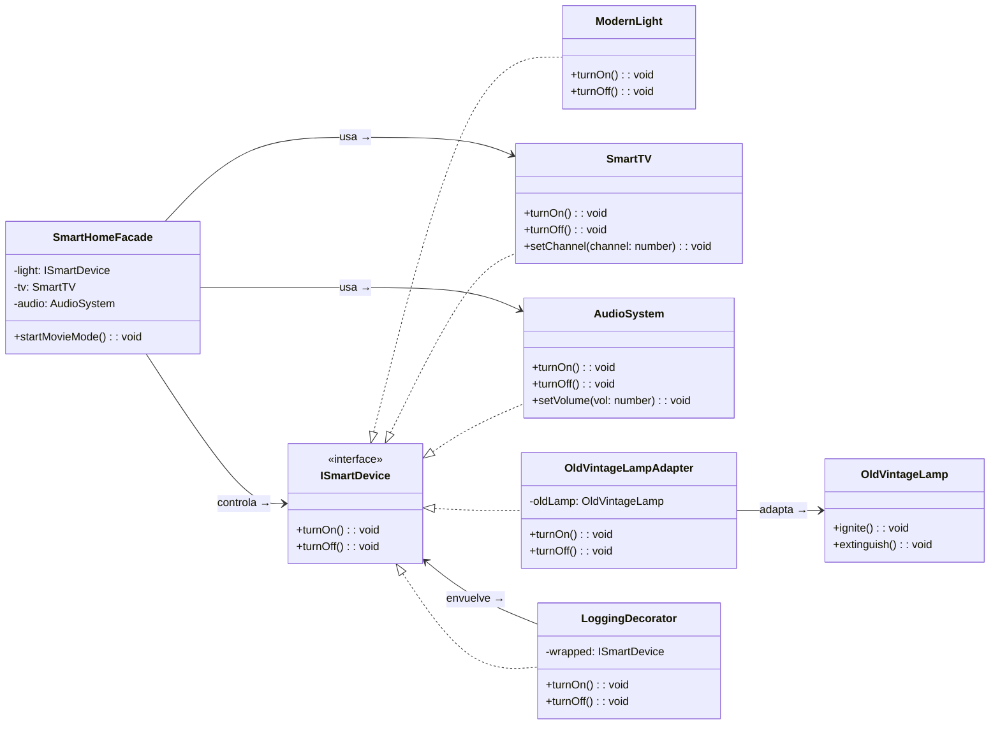

# Refactorización SmartHome con Patrones Estructurales (TypeScript)

Este proyecto contiene las **actividades practicas de Refactoring with Structural Patterns** pedidas en el enunciado.  
Implementada en **TypeScript**.

## Instalacion
Clona el repositorio:
```bash
git https://github.com/lauferreyra/Refactoring-with-Structural-Patterns.git
cd Refactoring-with-Structural-Patterns
 ``` 
## Instalar y ejecutar
```bash
npm install
npm run build
npm run start
```
---

## Evaluacion Teorica
En el código base se observaban estos problemas:
1. **Incompatibilidad entre dispositivos**  
   La clase `OldVintageLamp` no implementaba la interfaz común `ISmartDevice` y usaba métodos distintos (`ignite` / `extinguish`).  
   El código cliente tenía que preguntar con `instanceof` qué tipo de dispositivo era para saber qué método llamar.
2. **Complejidad para el usuario (Modo Cine)**  
   Para activar el modo cine, el cliente tenía que llamar paso a paso a varios dispositivos (`ModernLight`, `SmartTV`, `AudioSystem`), en el orden correcto y con la configuración adecuada.
3. **Responsabilidades mezcladas (Logging + Lógica)**  
   El logging se encontraba directamente dentro del dispositivo moderno (`ModernLight`), mezclando la responsabilidad de encender la luz con la de registrar eventos.

---

## 2. Patrones aplicados y cómo mejoran el diseño

### 2.1 Adapter – Unificar dispositivos incompatibles

El Adapter crea una clase intermedia que "traduce" la interfaz de un objeto incompatible a la interfaz esperada por el sistema.
Se creó la clase `OldVintageLampAdapter` que implementa `ISmartDevice` y envuelve a una `OldVintageLamp`:

```ts
class OldVintageLampAdapter implements ISmartDevice {
  constructor(private oldLamp: OldVintageLamp) {}

  turnOn(): void {
    this.oldLamp.ignite();
  }

  turnOff(): void {
    this.oldLamp.extinguish();
  }
}
```
Con esto, el código cliente ahora trabaja únicamente con `ISmartDevice`, se eliminan los `if/else` con `instanceof` y se puede agregar cualquier nuevo dispositivo legacy creando un Adapter sin tocar el código existente.
---
### 2.2 Facade – Simplificar el uso para el cliente

La Facade ofrece un punto de entrada sencillo para operaciones complejas que involucran varios objetos internos.
Se creó la clase `SmartHomeFacade` con el método `startMovieMode()`:
```ts
class SmartHomeFacade {
  constructor(
    private light: ISmartDevice,
    private tv: SmartTV,
    private audio: AudioSystem
  ) {}

  startMovieMode(): void {
    this.light.turnOff();
    this.tv.turnOn();
    this.tv.setChannel(101);
    this.audio.turnOn();
    this.audio.setVolume(50);
  }
}
```
De esta manera, el cliente ya no necesita orquestar manualmente todos los dispositivos. Un solo método `startMovieMode()` encapsula toda la lógica y el código es más fácil de leer y reutilizar.
---
### 2.3 Decorator – Agregar logging sin ensuciar las clases (Bonus)

El Decorator permite agregar responsabilidades adicionales a un objeto en tiempo de ejecución, envolviéndolo en otra clase que implementa la misma interfaz.
Se creó `LoggingDecorator`, que envuelve cualquier `ISmartDevice`:

```ts
class LoggingDecorator implements ISmartDevice {
  constructor(private wrapped: ISmartDevice) {}

  turnOn(): void {
    console.log("LOG: Encendiendo dispositivo...");
    this.wrapped.turnOn();
  }

  turnOff(): void {
    console.log("LOG: Apagando dispositivo...");
    this.wrapped.turnOff();
  }
}
```
Así, el logging deja de estar mezclado con la lógica de negocio de los dispositivos, y se puede agregar o quitar logging a cualquier dispositivo sin cambiar su código.
---
## 3. Diagrama UML (simplificado)

